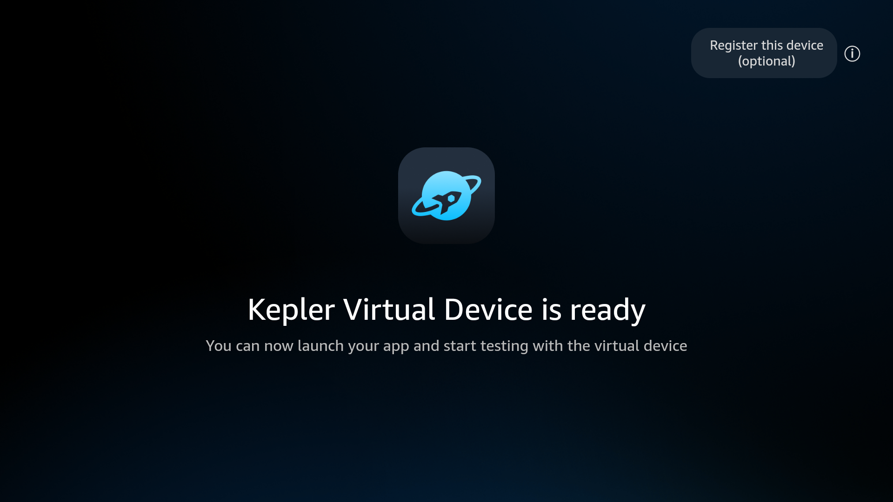

# vega-virtual-device-action

CI/CD building blocks for **Amazon Vega** (React Native for Fire TV) apps — Docker
images with the Vega SDK baked in, and a GitHub Action that boots the **Vega
Virtual Device (VVD)** emulator on a **free GitHub-hosted runner** (no GPU, no
self-hosted runner) and runs your scripts against a live device.

It is the Vega analogue of
[`reactivecircus/android-emulator-runner`](https://github.com/ReactiveCircus/android-emulator-runner).



> The real "Kepler Virtual Device is ready" home screen, captured **inside a
> container on a machine with no GPU** (pure CPU / Mesa llvmpipe software
> rendering). Getting this non-black screenshot is the crux of the project —
> see [`docs/vvd-docker-screenshot-fix.md`](docs/vvd-docker-screenshot-fix.md).

## What's in here

| Path | What it is |
|---|---|
| [`vega-virtual-device-action/`](vega-virtual-device-action/) | Composite GitHub Action: boots the VVD, waits for a ready screen, runs your script, captures a screenshot. **Start here** — see its [README](vega-virtual-device-action/README.md). |
| [`Dockerfile`](Dockerfile) | `vega-virtual-device-host` — the full image: Vega SDK **+ VVD emulator + software-GL stack** for running a device in CI. |
| [`Dockerfile.build-only`](Dockerfile.build-only) | `vega-sdk-builder` — slim image: Vega SDK only, **no emulator**, for build / lint / unit-test jobs. |
| [`docker-bake.hcl`](docker-bake.hcl) | buildx bake definition that builds both images. |
| [`scripts/`](scripts/) | [`start-vvd.sh`](scripts/start-vvd.sh) (boots the VVD non-black) and [`vvd-screenshot.sh`](scripts/vvd-screenshot.sh) (captures via the emulator console). Baked into the full image at `/scripts`. |
| [`examples/`](examples/) | [`argent-screenshot-test.sh`](examples/argent-screenshot-test.sh) — drives the booted VVD with [Argent](https://github.com/finloop/argent) and captures a screenshot. |
| [`docs/`](docs/) | [`vvd-docker-screenshot-fix.md`](docs/vvd-docker-screenshot-fix.md) — full walkthrough of the no-GPU screen-capture fix and the dead-ends behind it. |
| [`.github/workflows/`](.github/workflows/) | `docker-publish.yml` (build + push both images to GHCR) and `vvd-action-test.yml` (end-to-end smoke test of the action). |

## Images

Both images are published to GHCR by [`docker-publish.yml`](.github/workflows/docker-publish.yml)
on push to `main` and on `v*` tags. The SDK version is centralized in
[`.sdk-version`](.sdk-version) — see [Maintaining the SDK version](vega-virtual-device-action/README.md#maintaining-the-sdk-version).

| Image | Tags | Contains | Use for |
|---|---|---|---|
| `ghcr.io/<owner>/vega-virtual-device-host` | `latest`, `sdk-<version>` | Vega SDK, VVD emulator, Node 20, adb, Mesa llvmpipe + Xvfb | Booting a device — UI tests, screenshots, Argent runs |
| `ghcr.io/<owner>/vega-sdk-builder` | `latest`, `sdk-<version>` | Vega SDK, Node, npm | Build / lint / unit tests (no device) |

> **Note:** GHCR packages default to **private**. Consumers either make the
> package public or add `permissions: packages: read` + a `docker/login-action`
> step (shown in the action README).

## Quick start (GitHub Actions)

Boot the VVD on a free `ubuntu` runner and run a script against it:

```yaml
jobs:
  vvd-test:
    runs-on: ubuntu-22.04
    timeout-minutes: 60
    permissions:
      contents: read
      packages: read          # to pull the host image from GHCR
    steps:
      - uses: actions/checkout@v4

      - name: Enable KVM       # grants the runner access to /dev/kvm
        run: |
          echo 'KERNEL=="kvm", GROUP="kvm", MODE="0666", OPTIONS+="static_node=kvm"' \
            | sudo tee /etc/udev/rules.d/99-kvm4all.rules
          sudo udevadm control --reload-rules
          sudo udevadm trigger --name-match=kvm

      - name: Boot VVD and run tests
        id: vvd
        uses: <owner>/vega-virtual-device-action/vega-virtual-device-action@main
        with:
          image: ghcr.io/<owner>/vega-virtual-device-host:latest
          screenshot-path: artifacts/home.png
          script: |
            # device is live here; vega / vda / vvd-screenshot.sh are on PATH
            vega exec vda devices
            ./run-tests.sh

      - uses: actions/upload-artifact@v4
        if: always()
        with:
          name: vvd-artifacts
          path: artifacts/
```

Full input/output reference and a deeper explanation of how it works are in the
[action README](vega-virtual-device-action/README.md).

## How it works (the short version)

The VVD guest is a QEMU VM running Poky/Yocto Linux (not Android). Two things make
it usable in CI:

1. **Acceleration** needs **KVM** (`/dev/kvm`) — the one piece of real hardware
   required, and free GitHub Linux runners expose it after the "Enable KVM" step.
2. **A non-black screen** needs `-gpu host` backed by **Mesa llvmpipe** (software
   GL on the CPU) plus an Xvfb display and IPv6 re-enabled on loopback. None of
   that needs a GPU. The full rationale, dead-ends, and gotchas are documented in
   [`docs/vvd-docker-screenshot-fix.md`](docs/vvd-docker-screenshot-fix.md).

Inside the container, [`scripts/start-vvd.sh`](scripts/start-vvd.sh) boots the
device and [`scripts/vvd-screenshot.sh`](scripts/vvd-screenshot.sh) captures the
framebuffer via the emulator console. Readiness is gated on a **non-black
framebuffer** rather than `getprop`/`status` (neither is reliable here).

## Building the images locally

Requires Docker with Buildx, and `--privileged --device /dev/kvm --init` to *run*
the host image (see the docs for why each flag is needed).

```bash
# Build both images (full + build-only)
docker buildx bake --set "*.tags=vega-virtual-device-host:local" full

# Run the host image and capture a screenshot
docker run -d --name vvd --privileged --device /dev/kvm --init \
  --entrypoint /bin/bash vega-virtual-device-host:local -c 'sleep infinity'
docker exec vvd /scripts/start-vvd.sh
docker exec vvd /scripts/vvd-screenshot.sh /out/shot.png
```

## License

See repository for license details.
